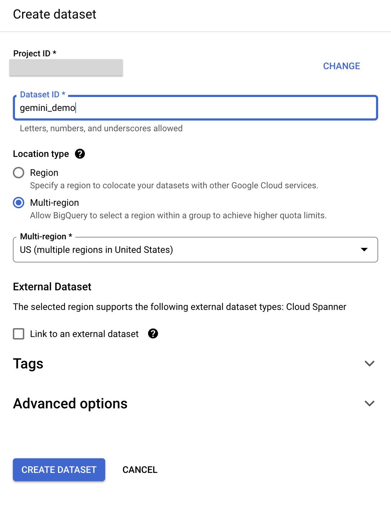

# Analyzing Movie Posters in BigQuery with Remote Models

## Introduction
In this lab, you will learn how to use BigQuery Machine Learning for inference with remote models (Gemini models) to analyze movie poster images and generate summaries of the movies based on the posters directly in your BigQuery data warehouse.

### Running ML models using GoogleSQL Queries

Usually, performing ML or artificial intelligence (AI) on large datasets requires extensive programming and knowledge of ML frameworks. This limits solution development to a small group of specialists within each company. With BigQuery Machine Learning for inference, SQL practitioners can use existing SQL tools and skills to build models, and generate results from LLMs and Cloud AI APIs.

### **What you'll learn:**
- How to configure your environment and account to use APIs
- How to create a Cloud Resource connection in BigQuery
- How to create a dataset and object table in BigQuery for movie poster images
- How to create the Gemini remote models in BigQuery
- How to prompt the Gemini model to provide movie summaries for each poster
- How to generate text embeddings for the movie represented in each poster
- How to use BigQuery VECTOR_SEARCH to match movie poster images with closely related movies in the dataset

---

## Task 1: Create a Cloud Resource connection
In this task, you will create a **Cloud Resource** connection, which enables BigQuery to access image files in Cloud Storage and make calls to Vertex AI.

1. In the Google Cloud Console, open the navigation menu and click **BigQuery**.
2. To create a connection, click **+ Add data**, and then select **Vertex AI**.


3. Select **Vertex AI models: BigQuery federation**
4. In the **Connection type** list, select **Vertex AI remote models, remote functions and BigLake (Cloud Resource)**.
5. In the **Connection ID** field, enter `gemini_conn` for your connection.
6. For **Location** type, select **Multi-region** and then, from dropdown select **US multi-region**.
7. Use the defaults for the other settings. 


7. Click **Create connection**.
8. A small pop-up should appear at bottom of page. Click **GO TO CONNECTION**.
9. In the Connection info pane, copy the **service account ID** to a text file for use in the next task. You will also see that the connection is added under the **External Connections** section of your project in the BigQuery Explorer.

## Task 2: Grant IAM permissions to the connection's service account and your own account
In this task, you grant the Cloud Resource connection's service account IAM permissions, through a role, to enable it access the Vertex AI services.

1. In the Google Cloud console, on the **Navigation menu**, click **IAM & Admin**.
2. Click **Grant Access**.
3. In the **New principals** field, enter the service account ID that you copied earlier.
4. In the Select a role field, enter **Vertex AI**, and then select **Vertex AI User** role.


5. Click **Save**. The result is the service account ID now includes the Vertex AI User role.
6. Grant yourself the **BigQuery Admin** role and save.

## Task 3: Create the dataset and object table in BigQuery for movie poster images

In this task, you will create a dataset for the project and an object table within it to store the poster images.

The dataset of movie poster images used in this tutorial are stored in a public Google Cloud Storage bucket: `gs://cloud-samples-data/vertex-ai/dataset-management/datasets/classic-movie-posters`

### Create a dataset
You will create a dataset to store database objects, including tables and models, used in this tutorial.

1. In the Google Cloud console, go to **BigQuery**.
2. In the **Explorer** panel, next to your project name, select the 3 dots, and then select **Create dataset**.
3. In the **Create dataset** pane, enter the following information:

| Field | Value |
|----------|-------|
| Dataset ID | gemini_demo |
| Location type | Multi-region |
| Multi-region | US |

4. Leave the other fields at their defaults. 



5. Click **Create Dataset**.

The result is the ```gemini_demo dataset``` is created and listed underneath your project in the BigQuery Explorer.

### Create the object table
BigQuery holds not only structured data, but it can also access unstructured data (like the poster images) through object tables.

You create an object table by pointing to a Cloud Storage bucket, and the resulting object table has a row for each object from the bucket with its storage path and metadata.

To create the object table you will use a SQL query.

1. Click the + to Create new SQL query. In the query editor, paste the query below.

```sql
CREATE OR REPLACE EXTERNAL TABLE
  `gemini_demo.movie_posters`
WITH CONNECTION `us.gemini_conn`
OPTIONS (
  object_metadata = 'SIMPLE',
  uris = ['gs://cloud-samples-data/vertex-ai/dataset-management/datasets/classic-movie-posters/*']
  );
```

3. Run the query. The result is a movie_posters object table added to the ```gemini_demo dataset``` and loaded with the URI (the Cloud Storage location) of each movie poster image.
4. In the Explorer, click on the ```movie_posters``` and review the schema and details. Feel free to query the table to review specific records.

## Task 4: Create the Gemini remote model in BigQuery
Now that the object table is created, you can begin to work with it. In this task, you will create a remote model for Gemini 2.0 Flash to make it available in BigQuery.

### Create the Gemini 2.0 Flash remote model
1. Click the + to Create new SQL query. In the query editor, paste the query below and run it.

```sql
CREATE OR REPLACE MODEL `gemini_demo.gemini_flash_2_0`
REMOTE WITH CONNECTION `us.gemini_conn`
OPTIONS (endpoint = 'gemini-2.0-flash-001')
```

The result is the ```gemini_flash_2_0``` model is created and you see it added to the ```gemini_demo``` dataset, in the models section.

2. In the Explorer, click on the ```gemini_flash_2_0``` model and review the details and schema. 

## Task 5: Prompt Gemini to provide movie summaries for each poster
In this task, you will use Gemini (the Gemini Flash 2.0 model you just created) to analyze the movie poster images and generate summaries for each movie.

### Analyze the images with Gemini Flash 2.0 model
1. Click the + to create a new SQL query. In the query editor, paste the query below, and run it.

```sql
CREATE OR REPLACE TABLE
`gemini_demo.movie_posters_results` AS (
SELECT
    uri,
    ml_generate_text_llm_result
FROM
    ML.GENERATE_TEXT( MODEL `gemini_demo.gemini_flash_2_0`,
    TABLE `gemini_demo.movie_posters`,
    STRUCT( 0.2 AS temperature,
        'For the movie represented by this poster, what is the movie title and year of release? Answer in JSON format with two keys: title, year. title should be string, year should be integer.' AS PROMPT,
        TRUE AS FLATTEN_JSON_OUTPUT)));
```

The result is the movie_posters_results table is created.

3. In the Explorer, click on the ```movie_posters_results``` table and review the schema and details.
4. Click the + to create a new SQL query. In the query editor, paste and run the query below.

```sql
SELECT * FROM `gemini_demo.movie_posters_results`
```

The result is rows for each movie poster with the URI (the Cloud Storage location of the movie poster image) and a JSON result including the movie title and the year the movie was released from the Gemini Flash 2.0 model.

You can retrieve these results in a more human readable way, by using the next query.

5. Click the + to create a new SQL query. In the query editor, paste and run the query below.

```sql
CREATE OR REPLACE TABLE
  `gemini_demo.movie_posters_results_formatted` AS (
  SELECT
    uri,
    JSON_QUERY(RTRIM(LTRIM(results.ml_generate_text_llm_result, " ```json"), "```"), "$.title") AS title,
    JSON_QUERY(RTRIM(LTRIM(results.ml_generate_text_llm_result, " ```json"), "```"), "$.year") AS year
  FROM
    `gemini_demo.movie_posters_results` results )
```

The result is the movie_posters_result_formatted table is created.
6. You can query the table with the query below, to see the rows created.

```sql
SELECT * FROM `gemini_demo.movie_posters_results_formatted`
```

Notice how the URI column results remain the same, but the JSON is now converted to the title and year columns for each row.

### Prompt Gemini Flash 2.0 to provide movie summaries
You can use Gemini Flash 2.0 to provide movie summaries for each poster by running the query below.

```sql
SELECT
  uri,
  title,
  year,
  prompt,
  ml_generate_text_llm_result
  FROM
 ML.GENERATE_TEXT( MODEL `gemini_demo.gemini_flash_2_0`,
   (
   SELECT
     CONCAT('Provide a short summary of movie titled ',title, ' from the year ',year,'.') AS prompt,
     uri,
     title,
     year
   FROM
     `gemini_demo.movie_posters_results_formatted`
   LIMIT
     20 ),
   STRUCT(0.2 AS temperature,
     TRUE AS FLATTEN_JSON_OUTPUT));     
```

Notice how the result is similar to the previous query, but now the prompt used with Gemini is displayed in the prompt column and the result of using this prompt is included in the ml_generate_text_llm_result field; this includes a short summary of the movie.

## Task 6. Generate text embeddings using a remote model
In this task, you will generate text embeddings using a remote model so that you can perform further analysis.

### Create the remote model
To generate the text embeddings, you will need to use the remote ```text-multilingual-embedding-002``` model hosted on the endpoint and then you can generate the embeddings.

1. Click the + to create a new SQL query. In the query editor, paste and run the query below.

```sql
CREATE OR REPLACE MODEL `gemini_demo.text_embedding`
REMOTE WITH CONNECTION `us.gemini_conn`
OPTIONS (endpoint = 'text-multilingual-embedding-002')
```

The result is the ```text_embedding model``` is created and appears in the explorer underneath the ```gemini_demo``` dataset.

### Generate text embeddings for the title and year associated with the posters
You will need to create a table to store the results.

1. Click the + to create a new SQL query. In the query editor, paste and run the query below.

```sql
CREATE OR REPLACE TABLE
  `gemini_demo.movie_posters_results_embeddings` AS (
  SELECT
    *
  FROM
    ML.GENERATE_EMBEDDING(
    MODEL `gemini_demo.text_embedding`,
    (
    SELECT
      CONCAT('The movie titled ', title, ' from the year ', year,'.') AS content,
      title,
      year,
      uri
    FROM
      `gemini_demo.movie_posters_results_formatted` ),
    STRUCT(TRUE AS flatten_json_output)));
```

The result is the movie_poster_results_embeddings table is created containing the results of creating embeddings for the text content (uri, movie title and year released) from the gemini_demo.movie_posters_results_formatted table.

You can view the results of the query using the new query below:

```sql
SELECT * FROM `gemini_demo.movie_posters_results_embeddings`
```

### Generate text embeddings for a subset of the IMDB dataset
You will create a new view that contains only the movies in the dataset that were released prior to 1935.

Create and run a new query with the following SQL statement.

```sql
CREATE OR REPLACE VIEW
  `gemini_demo.imdb_movies` AS (
  WITH
    reviews AS (
      SELECT
        reviews.movie_id AS movie_id,
        title.primary_title AS title,
        title.start_year AS year,
        reviews.review AS review
      FROM
        `bigquery-public-data.imdb.reviews` reviews
      LEFT JOIN
        `bigquery-public-data.imdb.title_basics` title
      ON
        reviews.movie_id = title.tconst)
  SELECT
    DISTINCT(movie_id),
    title,
    year
  FROM
    reviews
  WHERE
    year < 1935)
```

The result is a new view containing a list of distinct movie IDs, titles, and year of release from the bigquery-public-data.imdb.reviews table for all movies in the dataset released before 1935.

Create and run a new query with the following SQL statement.

```sql
CREATE OR REPLACE TABLE
  `gemini_demo.imdb_movies_embeddings` AS (
  SELECT
    *
  FROM
    ML.GENERATE_EMBEDDING( MODEL `gemini_demo.text_embedding`,
      (
      SELECT
        CONCAT('The movie titled ', title, ' from the year ', year,'.') AS content,
        title,
        year,
        movie_id
      FROM
        `gemini_demo.imdb_movies` ),
      STRUCT(TRUE AS flatten_json_output) )
  WHERE
    ml_generate_embedding_status = '' );
```

The result of the query is a table that contains the embeddings for the text content of the gemini_demo.imdb_movies table.

### Match the movie poster images to IMDB movie_id using BigQuery VECTOR_SEARCH

Create and run a new query with the following SQL statement.

```sql
SELECT
  query.uri AS poster_uri,
  query.title AS poster_title,
  query.year AS poster_year,
  base.title AS imdb_title,
  base.year AS imdb_year,
  base.movie_id AS imdb_movie_id,
  distance
FROM
 VECTOR_SEARCH( TABLE `gemini_demo.imdb_movies_embeddings`,
   'ml_generate_embedding_result',
   TABLE `gemini_demo.movie_posters_results_embeddings`,
   'ml_generate_embedding_result',
   top_k => 1,
   distance_type => 'COSINE');
```

The query uses the VECTOR_SEARCH function to find the nearest neighbor in the gemini_demo.imdb_movies_embeddings table for each row in the gemini_demo.movie_posters_results_embeddings table. The nearest neighbor is found using the cosine distance metric, which determines how similar two embeddings are.

This query can be used to find the most similar movie in the IMDB dataset for each of the movies identified by Gemini 2.0 Flash in the movie posters. For example, you could use this query to find the closest match for the movie "Au Secours!" (identified by Gemini 2.0 Flash in one of the movie posters) in the IMDB public dataset, which references this movie by its English-language title, "Help!".

Create and run a new query to join some additional information on movie ratings provided in the IMDB public dataset.

```sql
SELECT
  query.uri AS poster_uri,
  query.title AS poster_title,
  query.year AS poster_year,
  base.title AS imdb_title,
  base.year AS imdb_year,
  base.movie_id AS imdb_movie_id,
  distance,
  imdb.average_rating,
  imdb.num_votes
FROM
  VECTOR_SEARCH( TABLE `gemini_demo.imdb_movies_embeddings`,
    'ml_generate_embedding_result',
    TABLE `gemini_demo.movie_posters_results_embeddings`,
    'ml_generate_embedding_result',
    top_k => 1,
    distance_type => 'COSINE') DATA
LEFT JOIN
  `bigquery-public-data.imdb.title_ratings` imdb
ON
  base.movie_id = imdb.tconst
ORDER BY
  imdb.average_rating DESC
```
This query is similar to the previous query. It still uses special numerical representations called vector embeddings to find similar movies to a given movie poster. However, it also joins the average rating and number of votes for each nearest neighbor movie from a separate table from the IMDB public dataset.

## Congratulations!
You successfully created an object table for your poster images in BigQuery, created remote Gemini models, used the models to prompt Gemini to analyze images and provided movie summaries, generated text embeddings for movie titles, and used embeddings to match movie poster images to the related movie title in the IMDB dataset.
