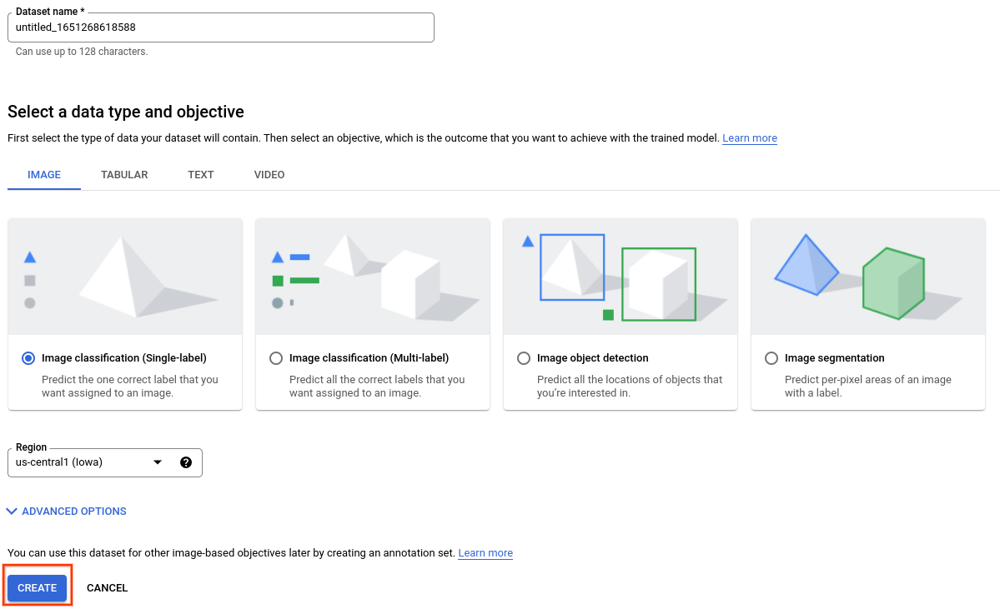
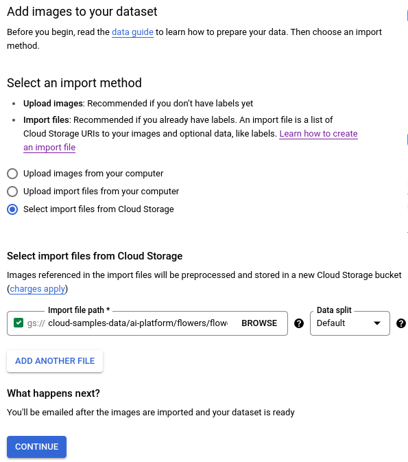
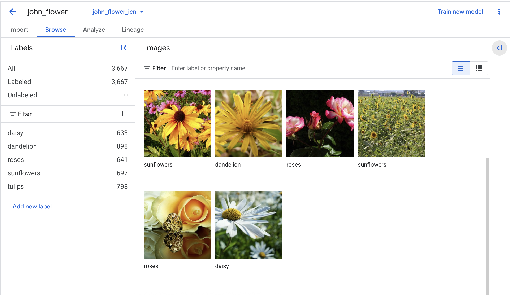
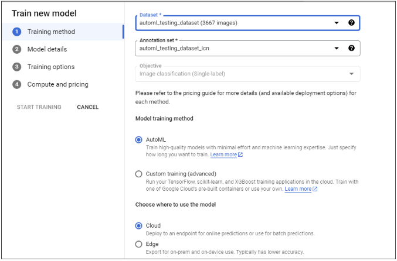
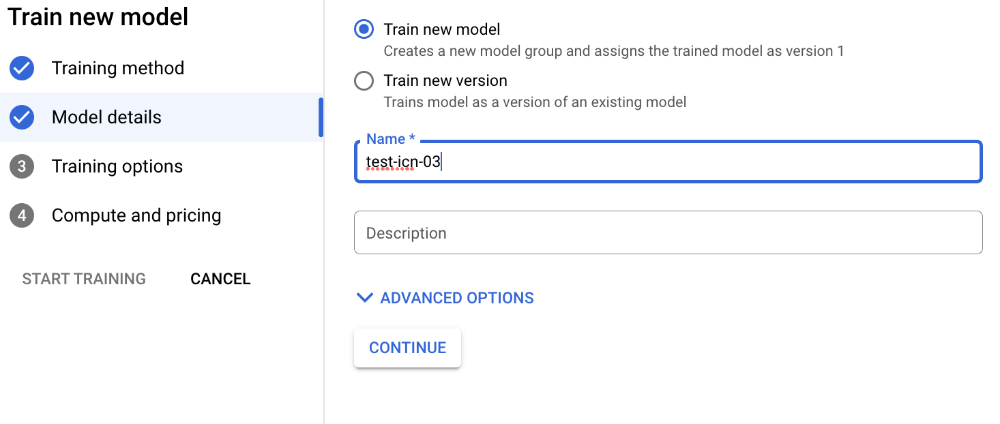
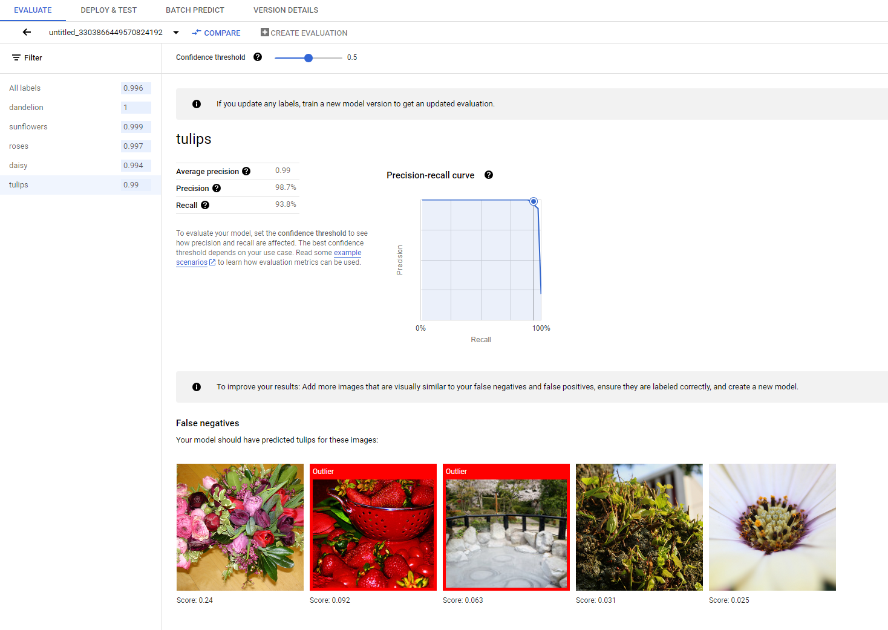
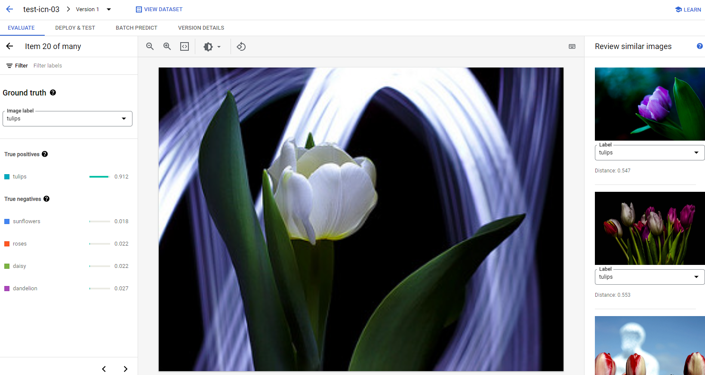

# AutoML Vision: Train an image classification model to classify flower type (without any code)!

This tutorial walks you through the required steps to train and get predictions from your image classification model in the Google Cloud console. 

### What you'll learn

As part of this lab, you will:

1. Create an image classification dataset, and import images.
2. Train an AutoML image classification model.
3. Evaluate and analyze model performance.
4. Deploy a model to an endpoint, and send a prediction.

## Task 1. Create an image classification dataset and import images

The image files you use in this tutorial are from the flower dataset and these input images are stored in a public Cloud Storage bucket. This publicly-accessible bucket also contains a CSV file you use for data import. This file has two columns: the first column lists an image's URI in Cloud Storage, and the second column contains the image's label. Below you can see some sample rows:

```gs://cloud-samples-data/ai-platform/flowers/flowers.csv```

```csv
gs://cloud-samples-data/ai-platform/flowers/daisy/10559679065_50d2b16f6d.jpg,daisy
gs://cloud-samples-data/ai-platform/flowers/dandelion/10828951106_c3cd47983f.jpg,dandelion
gs://cloud-samples-data/ai-platform/flowers/roses/14312910041_b747240d56_n.jpg,roses
gs://cloud-samples-data/ai-platform/flowers/sunflowers/127192624_afa3d9cb84.jpg,sunflowers
gs://cloud-samples-data/ai-platform/flowers/tulips/13979098645_50b9eebc02_n.jpg,tulips
```

### Create an image classification dataset and import data

1. Head to the Google Cloud console to begin the process of creating your dataset
2. Open the side navigation panel, click on **Vertex AI** > **Datasets**
3. Click **Create dataset**.
4. Specify a name for this  in this format -> <YOUR_NAME>_flowers (e.g. john_flowers)
5. In the Image tab of the "Select a data type and objective" section, choose the **Image classification (Single-label)** radio option. 
6. In the Region drop-down menu select **US Central**.
7. Select **Create** to create the empty dataset. After selecting Create you will advance to the data import window.



8. Select the **Select import files from Cloud Storage** and specify the Cloud Storage URI of the CSV file with the image location and label data. For this lab, the CSV file is at ```gs://cloud-samples-data/ai-platform/flowers/flowers.csv```. Copy and paste the following into the "Import file path" field:

```gs://cloud-samples-data/ai-platform/flowers/flowers.csv```



9. Click **Continue** to begin image import. The import process takes a few minutes. When it completes, you are taken to the next page that shows all of the images identified for your dataset, both labeled and unlabeled images.

> [!NOTE]  
> When using the indicated flower dataset, you will see several warning alerts. This is purposeful, to show you error messages you may encounter with your own data.

## Task 2. Train an AutoML image classification model

### Review imported images
After the dataset import, you are taken to the **Browse** tab. 



### Begin AutoML model training
1. On the right panel in your **Browse** page, click on **Train new model**. If you don't see this, head to **Vertex AI** > **Models** > **Create**
2. Check that the dataset is correct 
Under **Model training method**, select **AutoML**.
3. Under **Choose where to use the model**, select **Cloud** and click **Continue**.



4. Select **Train new model** and leave the model name as default



5. Under **Train options**, select **Higher Accuracy**
6. Leave **Incremental training** unchecked and click **Continue**
7. Under **Compute and pricing**. Specify a node-hour budget of **8 node hours**
8. Click **Start training**

> [!NOTE]  
> Training takes several hours. An email notification is sent when the model training completes.

## Task 3. Evaluating and analyzing model performance

### Understand AutoML model evaluation results

After training is completed, your model is automatically evaluated against the test data split. The corresponding evaluation results are presented by clicking the model's name from either the **Model Registry** page or the **Dataset** page.

From there, you can find the metrics to measure the model's performance.



You can find a more detailed introduction to different evaluation metrics in the [Evaluate, test, and deploy your model](https://cloud.google.com/vertex-ai/docs/beginner/beginners-guide/#evaluate_model) section.

### Analyze test results
If you want to continue improving the model performance, the first step is often to examine the error cases and investigate the potential causes. The evaluation page of each class presents detailed test images of the given class categorized as false negatives, false positives, and true positives. The definition of each category can be found in the [Evaluate, test, and deploy your model](https://cloud.google.com/vertex-ai/docs/beginner/beginners-guide/#evaluate_model) section.

For each image under every category, you can further check the prediction details by clicking the image and access the detailed analysis results. You will see the Review similar images panel on the right side of the page, where the closest samples from the training set are presented with distances measured in the feature space.



## Task 4. Deploy a model to an endpoint and send a prediction

After your AutoML image classification model is done training, use the Google Cloud console to create an endpoint and deploy your model to the endpoint. After your model is deployed to this new endpoint, send an image to the model for label prediction.

### Deploy your model to an endpoint

Access your trained model to deploy it to a new or existing endpoint from the Models page:

1. In the Google Cloud console, navigate to **Vertex AI > Training**
2. Select your trained AutoML model. This takes you to the **Evaluate** tab where you can view model performance metrics.
3. Choose the **Deploy & test** tab.
4. Click **Deploy to endpoint**.
5. Choose **Create new endpoint**, set the endpoint name to ```<YOUR_NAME>>_automl_image```, then click **Continue**.
6. In **Model settings**, accept the **Traffic split** of **100%**, enter **1** in **Number of compute nodes**, then click **Done**.
7. Click **Deploy** to deploy your model to your new endpoint.

It takes several minutes to create the endpoint and deploy the AutoML model to the new endpoint.

### Send a prediction to your model
After the endpoint creation process finishes you can send a single image annotation (prediction) request in the Google Cloud console.

1. Navigate to the "Test your model" section of the same **Deploy & test** tab you used to create an endpoint in the previous step (**Models** > **your_model** > **Deploy & test**).

2. Click **Upload image** and choose a locally saved image for prediction, and view its predicted label.

## Congratulations
Congratulations! You have successfully trained your own classification model without writing a single line of code!