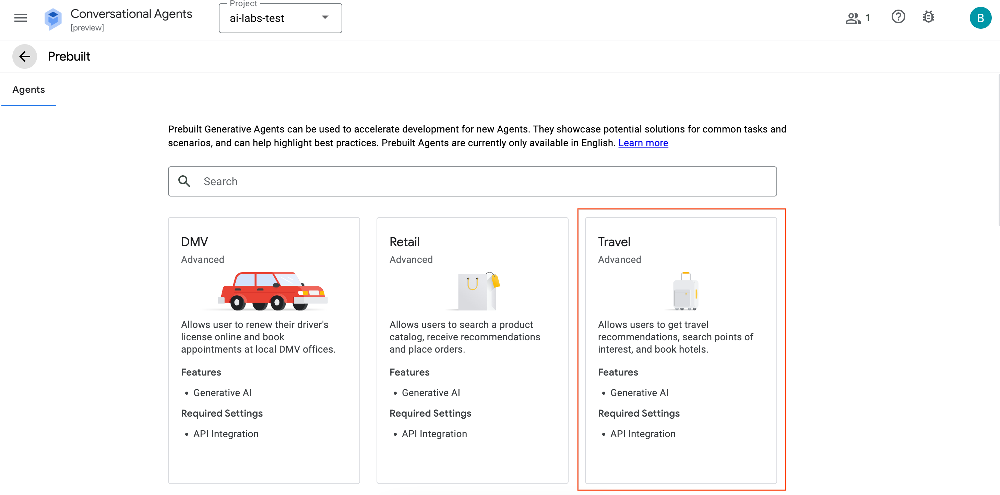
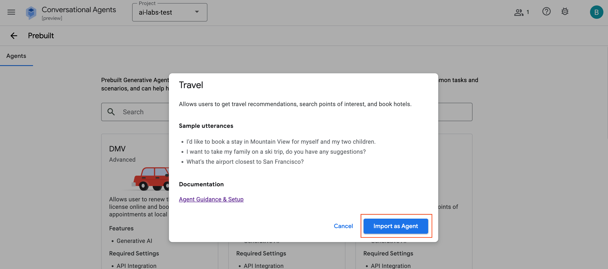
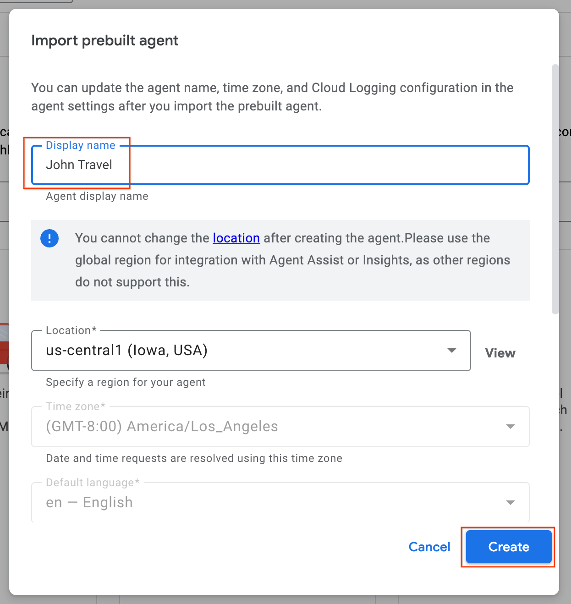
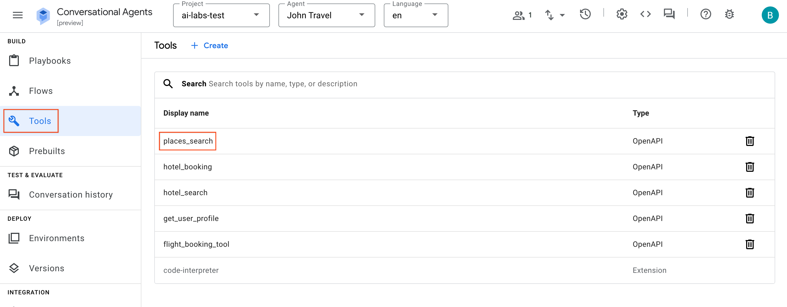
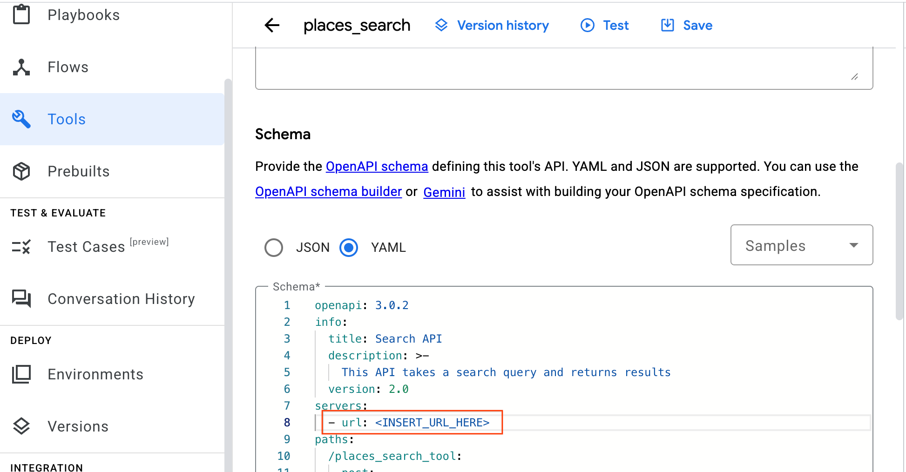
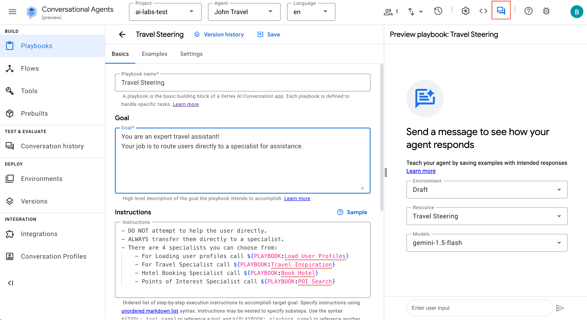
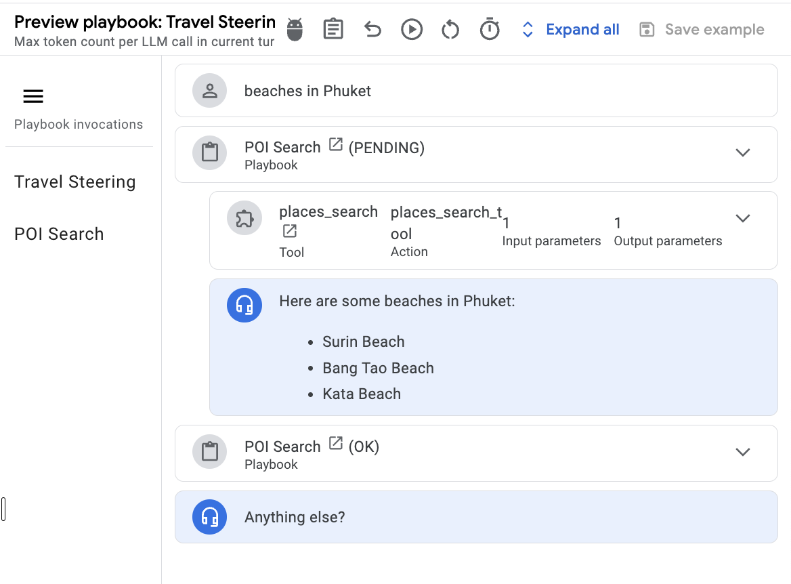

# Building Low Code Agents with Google Cloud's Conversational Agents

## Overview
In this lab, you'll deploy a pre-built low code generative AI agents using Google Cloud's Conversational Agents tool. We'll cover the essential concepts and walk you through the initial steps to get your first agent up and running.

With Conversational Agents, AI Agents can be created in just a few steps. For today's lab, we will be importing a Pre-Built Agent so that you can see how it works and play around with it
### Step 1: Go to Conversational Agents page
- Head over to the Conversational Agents console by clicking the following link: 
https://conversational-agents.cloud.google.com
- Select your project from the project menu
- Next, select **Use prebuilt agents**

- In the next page (shown below), select the **Travel** agent (You might have to scroll all the way down).
> [!NOTE]  
> You might see multiple travel-themed agents. Make sure to select the agent that is named **Travel**.



- Click on **Import Agent**


- For the settings, give your Agent a name **(e.g. John Travel)**
- Leave everything else as default and click on **Create**


- Next, in the left panel click on **Tools**
- Click into **places_search** tool.


<br><br>

- Scroll down to **Schema**
- In Line 8, you'll notice that the server URL is currently https://example.com
- We need to replace the server URL with an **active API** which we will be deploying in the next section.

### Step 2: Deploying our tools to Cloud Run Functions
All the steps in this section can also be found at the the [official documentation](https://cloud.google.com/dialogflow/cx/docs/concept/playbook/prebuilt/travel#tool-setup))

#### Download the installer.zip folder
- In your Cloud Shell terminal, download the ```installer.zip``` folder by running the following command:
```
wget https://storage.googleapis.com/gassets-api-ai/prebuilt_agents/generative-prebuilt-agents/installer.zip
```
- Next, unzip the ```installer.zip``` folder
```
unzip installer.zip -d installer/
```
#### Prepare your Cloud Shell environment
- Change directory into the ```installer``` folder 
```
cd installer
```
- Create a virtual environment
```
python3 -m venv venv
```
- Activate the virtual environment
```
source venv/bin/activate
```
- Install the requirements
```
pip install -r requirements.txt
```
- Run the following command to add the IAM roles to your user account:
```
gcloud projects add-iam-policy-binding $GOOGLE_CLOUD_PROJECT --member=user:$(gcloud config get-value account) --role='roles/serviceusage.serviceUsageAdmin' && \
gcloud projects add-iam-policy-binding $GOOGLE_CLOUD_PROJECT --member=user:$(gcloud config get-value account) --role='roles/cloudfunctions.developer' && \
gcloud projects add-iam-policy-binding $GOOGLE_CLOUD_PROJECT --member=user:$(gcloud config get-value account) --role='roles/firebase.developAdmin' && \
gcloud projects add-iam-policy-binding $GOOGLE_CLOUD_PROJECT --member=user:$(gcloud config get-value account) --role='roles/storage.objectUser'
```

- Authenticate the gcloud CLI: This command ensures your local terminal has the necessary permissions to communicate with your Google Cloud Project. Follow the browser prompts to sign in.
```
gcloud auth application-default login
```
#### Deploy the Cloud Run functions
- To deploy Cloud Run functions for our prebuilt travel agent, replace ```<YOUR_PROJECT_ID>``` with your project ID and run the following command:
```
python installer.py --project-id=<YOUR_PROJECT_ID> --prebuilt-id=travel
```
- Once completed, the output will provide the URLs to your Cloud Run functions and you may replace the URL under each respective tool's schema. 

- Once done, click **Save**


- Repeat this for the other tools - remember to always click **Save** after you edit!

- Once you're done, you are ready to test your travel agent! 
- Head back to Playbooks and select **Travel Steering**
- Click on the **Chat** icon at the top to toggle open the simulator


### Troubleshooting
#### Check if your Cloud Run functions is authenticated
TODO

#### Check if Places API and Places API (New) is enabled
TODO

### Ask away!
You can ask for recommendations, more information about certain places and also try to get it to book a hotel for you (of course it'll be a simulated booking, not an actual one!)
- Here are some as starters:
    - Beach vacation in Phuket
    - Hotels near the beach in Phuket
    - Hotels in Sentosa

For example: When asking about certain places you should be able to see that the ```places_search``` tool gets triggered to do a Google Maps API call and retrieve places related to your query. And that's how you get your agent to interact with other systems to enrich it.




